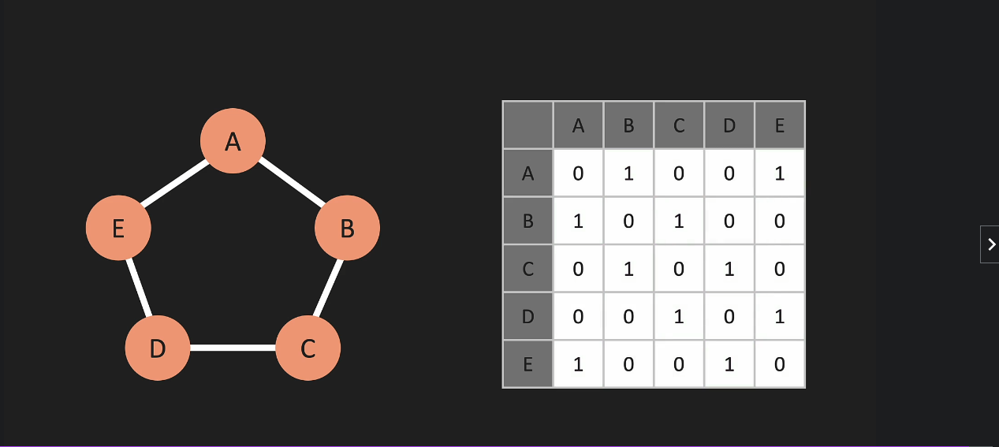
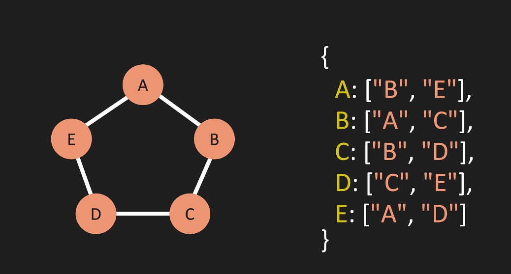

# Graphs

### Definition
A Graph is a non-linear data structure consisting of nodes and edges. The nodes are sometimes also referred to as vertices and the edges are lines or arcs that connect any two nodes in the graph. More formally a Graph can be defined as,

### Two most common ways to represent `Graphs`
 - `Adjacency Matrix`

    A two-dimensional array showing us the relationships (edges) in the `Graph`.
    <p align="center" style="margin-top:24px">
    
    </p>

 - `Adjacency List`
 
    A hast-table(or an object) showing us the relationships (edges) in the `Graph`.
    <p align="center" style="margin-top:24px">
    
    </p>

### Big O
The Big O of operations in the `Graph` depends on whether we're using an `Adjacency Matrix` or `Adjacency List`.

The `Adjacency List` outperforms the Matrix because of the more simple representation of the edges.

### Implementation

```javascript
class Graph {
    constructor() {
        this.adjacencyList = {}
    }

    addVertex(vertex) {
        if(!this.adjacencyList[vertex]) {
            this.adjacencyList[vertex] = []
            return true
        }
        return false
    }

    addEdge(vertex1, vertex2) {
        if (this.adjacencyList[vertex1] && this.adjacencyList[vertex2]) {
            this.adjacencyList[vertex1].push(vertex2)
            this.adjacencyList[vertex2].push(vertex1)
            return true
        }
        return false
    }

    removeEdge(vertex1, vertex2) {
        if (this.adjacencyList[vertex1] && this.adjacencyList[vertex2]) {
            this.adjacencyList[vertex1] = this.adjacencyList[vertex1]
                .filter(v => v !== vertex2)
            this.adjacencyList[vertex2] = this.adjacencyList[vertex2]
                .filter(v => v !== vertex1)
            return true
        }
        return false
    }

    removeVertex(vertex) {
        if (!this.adjacencyList[vertex]) return undefined
        while(this.adjacencyList[vertex].length) {
            let temp = this.adjacencyList[vertex].pop()
            this.removeEdge(vertex, temp)
        }  
        delete this.adjacencyList[vertex] 
        return this
    }
}
```