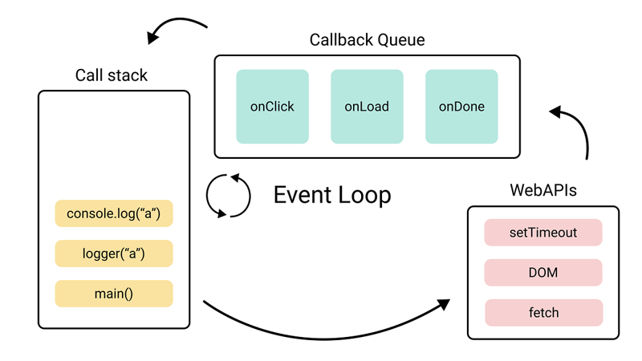

# JavaScript fundamentals cheatsheet

<a id="top"></a>

##### Table of contents

- [Event Loop](#event-loop)
- [Javascript Modules](#javascript-modules)
- [Variable declarations and hoisting](#variable-declarations-and-hoisting)
- [Closures](#closures)
- [Classes](#classes)
- [Prototypes](#prototypes)
- [This](#this)
- [Promises/async await](#promisesasync-await)
- [Javascript Array Methods](#javascript-array-methods)

#### Event Loop

The event loop is a core concept in JavaScript that enables non-blocking, asynchronous behavior.

Components of the Event Loop:

- _Call Stack_: Keeps track of function calls. When a function is invoked, it is pushed onto the stack. When the function finishes execution, it is popped off.
- _Web APIs_: Provides browser features like setTimeout, DOM events, and HTTP requests. These APIs handle asynchronous operations.
- _Task Queue (Callback Queue)_: Stores tasks waiting to be executed after the call stack is empty. These tasks are queued by setTimeout, setInterval, or other APIs.
- _Event Loop_: Continuously checks if the call stack is empty and pushes tasks from the microtask queue or task queue to the call stack for execution.



#### Javascript Modules

_ES Modules(ESM)_ are the standart in Javascript while NodeJS still uses _CommonJS(CJS)_ as a default.

```JavaScript
// ES Modules (ESM) - uses "export" and "import" syntax

import { foo, bar } from 'lib';
export const foobar = () => {}

import React from 'react';
export default MyComponent;

// CommonJS (CJS) - uses "module.exports" and "require" syntax

const do = require('lib');
module.exports = function doSomething() {do({...})}
```

#### Variable Declarations and hoisting

All variable declarations are hoisted to the top.

- `let` and `const`: block scoped, not initialized.
- `var`: function scoped, initialized with a value of `undefined`.

```javascript
// scope
{
  var x = 1;
  let y = 1;
  const z = 1;
}
console.log(x); // 1
console.log({ y, z }); // error because `y` and `z` have block scope

// hoisting and initialization
console.log(counter); // ReferenceError: Cannot access 'counter' before initialization
let counter = 1;
console.log(counter); // undefined
var counter = 1;
```

#### Closures

Closure means that an inner function always has access to the vars and parameters of its outer function, even after the outer function has returned.

```javascript
const Counter = () => {
  let counter = 0;
  increaseCounter = () => {
    return (counter += 1);
  };
  return increaseCounter;
};
const counter = Counter();
log(counter()); // 1
log(counter()); // 2
log(counter()); // 3
log(counter()); // 4
```

#### Classes

Classes are a template for creating objects. They encapsulate data with code to work on that data. Classes in JS are built on prototypes but have some syntax and semantics that are not shared with ES5 class-like semantics.

```Javascript
class Dog {
  constructor(name) {
    this.name = name;
  }

  greet = () => {
    console.log(`Bark, bark! This is ${this.name} speaking`);
  }
}
new Dog("Megatron").bark() // Bark, bark! This is Megatron speaking
```

#### Prototypes

All constructor functions in JavaScript have a special property called `prototype`, which works with the new operator.

The reference to the prototype object is copied to the internal `[[Prototype]]` property of the new instance.

For example, when you do const `a1 = new A()`, JavaScript (after creating the object in memory and before running function A() with this defined to it) sets `a1.[[Prototype]] = A.prototype`.

When you then access properties of the instance, JavaScript first checks whether they exist on that object directly, and if not, it looks in `[[Prototype]]`.

`[[Prototype]]` is looked at recursively, i.e. `a1.doSomething`, `Object.getPrototypeOf(a1).doSomething`, `Object.getPrototypeOf(Object.getPrototypeOf(a1)).doSomething` etc., until it's found or `Object.getPrototypeOf` returns null.

This means that all properties defined on prototype are effectively shared by all instances, and you can even later change parts of prototype and have the changes appear in all existing instances.

```Javascript
const parent = {
  value: 2,
  method() {
    return this.value + 1;
  },
};
const child = {
  __proto__: parent,
};
console.log(child.method()); // 3
```

#### This

The `this` keyword refers to the context where a piece of code, such as a function's body, is supposed to run. Most typically, it is used in object methods, where this refers to the object that the method is attached to, thus allowing the same method to be reused on different objects.

The value of `this` in JavaScript depends on how a function is invoked (runtime binding), not how it is defined.

_Arrow functions_ differ in their handling of `this`: they inherit `this` from the parent scope at the time they are defined.

The `Function.prototype.bind()` method can create a function whose this binding doesn't change, and methods `Function.prototype.apply()` and `Function.prototype.call()` can also set the this value for a particular call.

#### Promises/Async await

The Promise object represents the eventual completion (or failure) of an asynchronous operation and its resulting value. .then() and .catch() can be used to invoke the resolve and reject functions.

The async and await keywords enable asynchronous, promise-based behavior to be written in a cleaner style, avoiding the need to explicitly configure promise chains.

```javascript
const myFunction = new Promise((resolve, reject) => {
  // The producing code (this may take some time)
  const condition = true;

  if (condition) resolve("resolved state");
  else reject("rejected state");
});
```

#### JavaScript Array Methods.

- **Array.prototype.map()**
  - Returns a new array containing the results of invoking a function on every element in the calling array.
- **Array.prototype.filter()**
  - Returns a new array containing all elements of the calling array for which the provided filtering function returns true.
- **Array.prototype.forEach()**
  - Returns a new array containing all elements of the calling array for which the provided filtering function returns true.
- **Array.prototype.every()**
  - Returns true if every element in the calling array satisfies the testing function.
- **Array.prototype.some()**
  - Returns true if at least one element in the calling array satisfies the provided testing function.
- **Array.prototype.sort()**
  - Sorts the elements of an array in place and returns the array.
- **Array.prototype.at()**
  - Returns the array item at the given index. Accepts negative integers, which count back from the last item.
- **Array.prototype.concat()**
  - Returns a new array that is the calling array joined with other array(s) and/or value(s).
- **Array.prototype.entries()**
  - Returns a new [array iterator](https://developer.mozilla.org/en-US/docs/Web/JavaScript/Reference/Global_Objects/Array/@@iterator) object that contains the key/value pairs for each index in an array.
  ```javascript
  const a = ["a", "b", "c"];
  for (const [index, element] of a.entries()) console.log(index, element);
  // 0 'a'
  // 1 'b'
  // 2 'c'
  ```
- **Array.prototype.fill()**
  - Fills all the elements of an array from a start index to an end index with a static value.
- **Array.prototype.find()**
  - Returns the found element in the calling array, if some element in the array satisfies the testing function, or undefined if not found.
- **Array.prototype.findIndex()**
  - Returns the found index in the calling array, if an element in the array satisfies the testing function, or -1 if not found.
- **Array.prototype.flat()**

  - Returns a new array with all sub-array elements concatenated into it recursively up to the specified depth.

  ```javascript
  const arr1 = [0, 1, 2, [3, 4]];

  console.log(arr1.flat());

  // expected output: [0, 1, 2, 3, 4]
  ```

- **Array.prototype.flatMap()**
  - Returns a new array formed by applying a given callback function to each element of the calling array, and then flattening the result by one level.
- **Array.prototype.groupBy()**
  - Groups the elements of an array according to the results of a test function. The resulting groups are accessed using object properties.
  ```javascript
  const inventory = [
    { name: "apples", type: "vegetables", quantity: 5 },
    { name: "bananas", type: "fruit", quantity: 0 },
    { name: "goat", type: "meat", quantity: 23 },
    { name: "cherries", type: "fruit", quantity: 5 },
    { name: "fish", type: "meat", quantity: 22 },
  ];
  const result = inventory.groupBy(({ type }) => type);
  /* expected
    { 
      vegetables: [ 
        { name: "apples", type: "vegetables", quantity: 5 } 
      ],
      fruit: [
        { name: "bananas", type: "fruit", quantity: 0 },
        { name: "cherries", type: "fruit", quantity: 5 }
      ], 
      meat: [
        { name: "goat", type: "meat", quantity: 23 },
        { name: "fish", type: "meat", quantity: 22 }
      ] 
    }
    */
  ```
- **Array.prototype.includes()**
  - Determines whether the calling array contains a value, returning true or false as appropriate.
- **Array.prototype.indexOf()**
  - Returns the first (least) index at which a given element can be found in the calling array.
- **Array.prototype.join()**
  - Joins all elements of an array into a string.
- **Array.prototype.keys()**
  - Returns a new [array iterator](https://developer.mozilla.org/en-US/docs/Web/JavaScript/Reference/Global_Objects/Array/@@iterator) that contains the keys for each index in the calling array.
- **Array.prototype.lastIndexOf()**
  - Returns the last (greatest) index at which a given element can be found in the calling array, or -1 if none is found.
- **Array.prototype.pop()**
  - Removes the last element from an array and returns that element.
- **Array.prototype.push()**
  - Adds one or more elements to the end of an array, and returns the new length of the array.
- **Array.prototype.reduce()**

  - Executes a user-supplied "reducer" callback function on each element of the array (from left to right), to reduce it to a single value.

  ```javascript
  const array1 = [1, 2, 3, 4];
  const initialValue = 0;

  const sumWithInitial = array1.reduce(
    (previousValue, currentValue) => previousValue + currentValue,
    initialValue
  );

  console.log(sumWithInitial);
  // expected output: 10
  ```

- **Array.prototype.reduceRight()**
  - Executes a user-supplied "reducer" callback function on each element of the array (from right to left), to reduce it to a single value.
- **Array.prototype.reverse()**
  - Reverses the order of the elements of an array in place. (First becomes the last, last becomes first.)
- **Array.prototype.shift()**
  - Removes the first element from an array and returns that element.
- **Array.prototype.slice()**

  - Extracts a section of the calling array and returns a new array.

  ```javascript
  //syntax:
  slice(start, end);

  const animals = ["ant", "bison", "camel", "duck", "elephant"];
  console.log(animals.slice(2));
  // expected output: Array ["camel", "duck", "elephant"]

  console.log(animals.slice(2, 4));
  // expected output: Array ["camel", "duck"]

  console.log(animals.slice(1, 5));
  // expected output: Array ["bison", "camel", "duck", "elephant"]
  ```

- **Array.prototype.sort()**
  - Sorts the elements of an array in place and returns the array.
  ```javascript
  // compareFunction(a, b) should return:
  // > 0 : to sort b before a
  // < 0 : to sort a before b
  // = 0 : to keep original order of a and b
  ```
- **Array.prototype.splice()**
  - Adds or remove elements to the array
  ```javascript
  // syntax: splice(start, deleteCount, item1, item2, itemN)
  ```
- **Array.prototype.unshift()**
  - Adds one or more elements to the front of an array, and returns the new length of the array.
- **Array.prototype.values()**
  - Returns a new [array iterator](https://developer.mozilla.org/en-US/docs/Web/JavaScript/Reference/Global_Objects/Array/@@iterator) object that contains the values for each index in the array.
