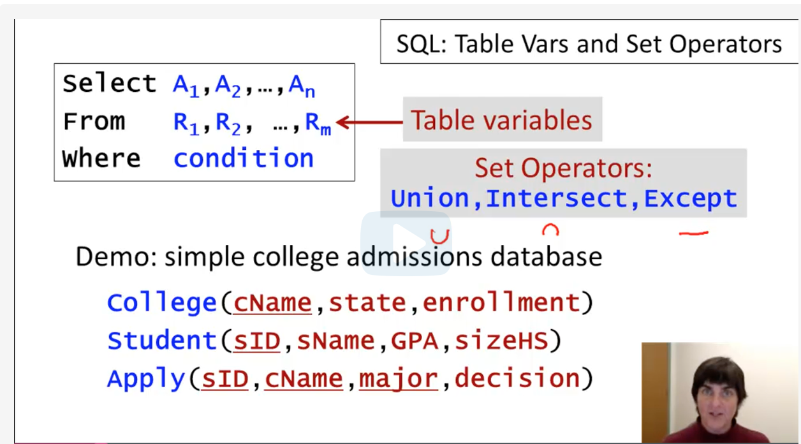

[Back to course frontpage](courses/introduction-to-sql/index.md)

## SQL: Table Variables and Set Operators



In this example we're using variables to simplify the statement and make it shorter.

```SQL

SELECT S.sID, sName, GPA, A.cName, enrollment
from Student S, College C, Apply A
where A.sID = S.sID and A.cName = C.cName;

```

In the following example we're looking for a pair of students with the same GPA and we're using variables to make the distinction in the pair of students because we have the same relation twice.

```SQL
SELECT S1.sID, S1.sName, S1.GPA, S2.sID, S2.sName, S2.GPA
FROM Student S1, Student S2
where S1.GPA = S2.GPA and S1.sID <> S2.sID
```

### Set Operators

- **Union**
  We can use Union to generate a list that includes a set of attributes from different relations.

  The following query will produce a list with all college and student names.

  ```SQL
    SELECt cName as name from College
    union
    select sName as name from Student
  ```

  The **union** operator by default eliminates duplicates. If we want to see the duplicates, we can use **union all** instead.

- **Intersect**
  We can use **intersect** to combine 2 select statements and only return the datasets that are common in both the statements.

  ```SQL
  select sID from Apply where major = 'CS'
  intersect
  select sID from Apply where major = 'EE'
  ```

  Some RDBMS don't support intersect. The following query produces the exact same result.

  ```SQL
  SELECT distinct A1.sID
  FROM Apply A1, Apply A2
  where A1.sID = A2.sID and A1.major = 'CS' and A2.major = 'EE';
  ```

- **Except**
  The **except** or **difference** operator is used to find the difference between two datasets.

  If we wanted to find all students who applied to Computer Science but did not apply to EE, we could use the following query.

  ```SQL
  SELECT sID from Apply where major = 'CS'
  EXCEPT
  SELECT sID from Apply where major = 'EE'
  ```

  Some RDBMS don't support the Except operator as well. We could use the following query to produce a similar result. The problem is that there might be new records that are not present in the previous one since there could be a pair where the Student applied to CS and EE but another pair where they didn't and they would get included in the results.

  ```SQL
    SELECT A1.sID
    FROM Apply A1, Apply A2
    where A1.sID = A2.sID and A1.major = 'CS' and A2.major <> 'EE'
  ```

[Back to course index](./index.md)
