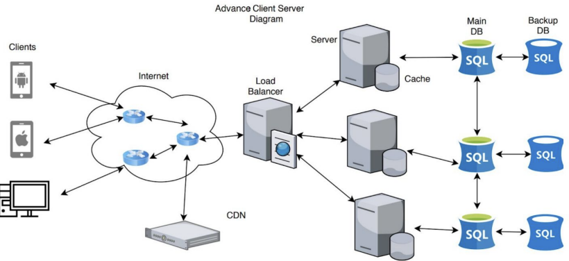

[Back to Architectural Styles](../07-architectural-styles.md)

### Distributed Systems

##### Available Resources

[Overview of Distributed Architecture](https://www.tutorialspoint.com/software_architecture_design/distributed_architecture.htm)

#### Introduction

Distributed systems refer to the design and organization of software components that are distributed across multiple devices or locations, connected via a network, and work together to achieve a common goal.

The main challenge in designing distributed systems is dealing with the inherent complexity that arises from the distribution of components and the communication between them, and it requires techniques such as load balancing, replication, and partitioning to improve scalability, fault-tolerance, and performance.

Additionally, security and coordination are also important aspects of distributed systems.

#### Client-Server Distributed Architecture

The client-server architecture is a common architecture pattern used in distributed systems, where a client (or multiple clients) send requests to a server, and the server responds to those requests. The client and server are separate entities that communicate over a network, such as the Internet or a local network.

The client is responsible for presenting the user interface and handling user input, while the server is responsible for processing the requests and returning the appropriate response. The server can also handle tasks such as data storage, security, and business logic.

[Introduction to Client-Server Architecture - University of Waterloo](https://cs.uwaterloo.ca/~m2nagapp/courses/CS446/1195/Arch_Design_Activity/ClientServer.pdf)

#### Peer to Peer

Peer-to-peer (P2P) architecture is a distributed computing architecture in which each node (peer) in the network acts as both a client and a server. In P2P architecture, there is no central authority or server that manages the network, and each node communicates directly with other nodes to exchange information, share resources, and perform computations.

The main advantage of using P2P architecture is that it allows for a more decentralized and fault-tolerant system. As there is no central authority, there is no single point of failure, and the network can continue to function even if some nodes fail. Additionally, P2P architecture can also improve scalability as the number of nodes in the network increases.

[Peer to Peer Architecture](https://student.cs.uwaterloo.ca/~cs446/1171/Arch_Design_Activity/Peer2Peer.pdf)
