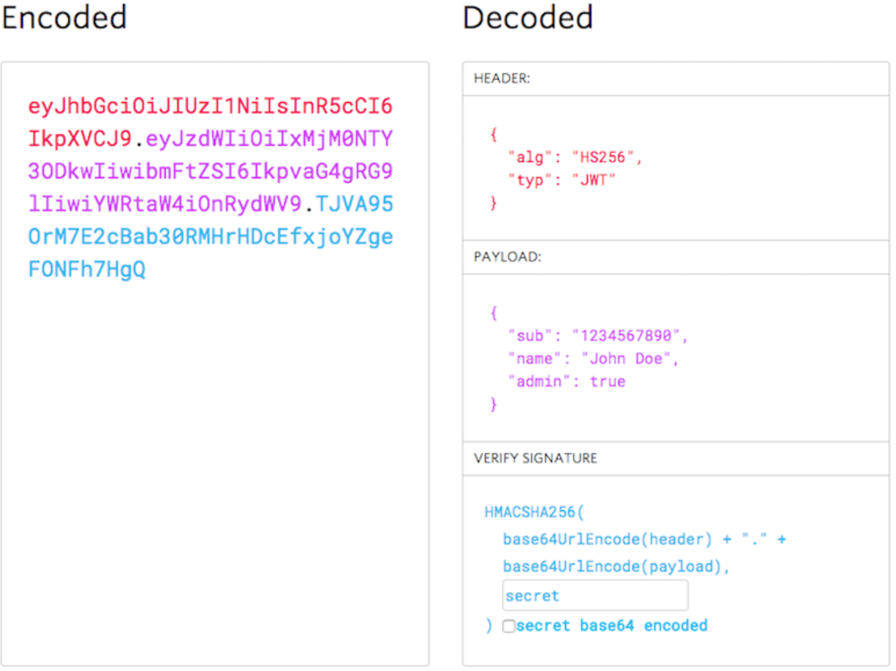

[Back to Authentication index](./index.md)

#### JWT Authentication

`JWT` (JSON Web Token) is an open standard for securely transmitting information between parties as a JSON object. It consists of three parts:

- a header (which specifies the token type and algorithm used for signing)
- a payload (which contains the claims or the data being transmitted)
- a signature (which is used to verify the token’s integrity and authenticity).

JWTs are commonly used for authentication and authorization purposes, allowing users to securely transmit and validate their identity and permissions across web applications and APIs. They are compact, self-contained, and can be easily transmitted in HTTP headers, making them popular for modern web and mobile applications.

A common way to use JWTs is OAuth Bearer Tokens.

##### JWT structure example

##### How JWT works

1. User signs up, password is hashed and stored.
2. User signs in, password is hashed and compared against the stored hash.
3. After successful authentication, the server issues a JWT with appropriate claims, signed with the secret/private key.
4. Front-end stores the JWT and includes it in requests using the Bearer token format.
5. The server verifies the JWT using the public key (for RS256) or shared secret (for HS256) to validate the token and its authenticity before processing the request.

[Next: OAuth Authentication](./02-oauth.md)
