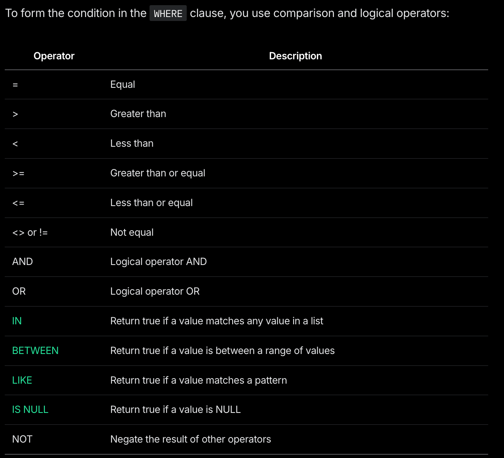

[Back to Tutorial front page](./index.md)

### PostgreSQL Tutorial Section 2: Filtering Data

#### 1. WHERE clause

The **SELECT** statement returns all rows from one or more columns in a table. To retrieve rows that satisfy a specified condition, you use a **WHERE** clause.

The syntax of the PostgreSQL WHERE clause is as follows:

```SQL
SELECT select_list
FROM table_name
WHERE condition
ORDER BY sort_expression;
```

##### Operators in there WHERE clause:



**Examples**

```SQL
SELECT
  last_name,
  first_name
FROM
  customer
WHERE
  first_name = 'Jamie'
  AND last_name = 'Rice';
```

```SQL
SELECT
  first_name,
  last_name
FROM
  customer
WHERE
  first_name IN ('Ann', 'Anne', 'Annie');
```

```SQL
SELECT
  first_name,
  last_name
FROM
  customer
WHERE
  first_name LIKE 'Ann%'; --Ann% matches any string starts with "Ann"
```

```SQL
SELECT
  first_name,
  LENGTH(first_name) name_length
FROM
  customer
WHERE
  first_name LIKE 'A%'
  AND LENGTH(first_name) BETWEEN 3
  AND 5
ORDER BY
  name_length;
```

#### 2. AND operator

In PostgreSQL, a boolean value can have one of three values: true, false, and null.

PostgreSQL uses **true, 't', 'true', 'y', 'yes', '1'** to represent **true** and **false, 'f', 'false', 'n', 'no', and '0'** to represent **false**.

A boolean expression is an expression that evaluates to a boolean value. For example, the expression 1=1 is a boolean expression that evaluates to true.

```SQL
SELECT true AND true AS result;
```

```
....
result
--------
 t
(1 row)
```

**Examples**

```SQL
SELECT
  title,
  length,
  rental_rate
FROM
  film
WHERE
  length > 180
  AND rental_rate < 1;
```

#### 3. OR operator

**Examples**

```SQL
SELECT true OR false AS result;
```

```
...
result
--------
 t
(1 row)
```

```SQL
SELECT
  title,
  rental_rate
FROM
  film
WHERE
  rental_rate = 0.99 OR
  rental_rate = 2.99;
```

```
Output:
title            | rental_rate
-----------------------------+-------------
 Academy Dinosaur            |        0.99
 Adaptation Holes            |        2.99
 Affair Prejudice            |        2.99
 African Egg                 |        2.99
...
```

#### 3. LIMIT clause

PostgreSQL **LIMIT** is an optional clause of the **SELECT** statement that constrains the number of rows returned by the query.

Here’s the basic syntax of the **LIMIT** clause:

```SQL
SELECT
  select_list
FROM
  table_name
ORDER BY
  sort_expression
LIMIT
  row_count;
```

If you want to skip a number of rows before returning the row_count rows, you can use **OFFSET** clause placed after the **LIMIT** clause:

```SQL
SELECT
  select_list
FROM
  table_name
ORDER BY
  sort_expression
LIMIT
  row_count
OFFSET
  row_to_skip;
```

**Examples**

```SQL
SELECT
  film_id,
  title,
  release_year
FROM
  film
ORDER BY
  film_id
LIMIT
  5;
```

```
Output:
film_id |      title       | release_year
---------+------------------+--------------
       1 | Academy Dinosaur |         2006
       2 | Ace Goldfinger   |         2006
       3 | Adaptation Holes |         2006
       4 | Affair Prejudice |         2006
       5 | African Egg      |         2006
(5 rows)
```

To retrieve 4 films starting from the fourth one ordered by film_id, you can use both LIMIT and OFFSET clauses as follows:

```SQL
SELECT
  film_id,
  title,
  release_year
FROM
  film
ORDER BY
  film_id
LIMIT 4 OFFSET 3;
```

```
Output:
film_id |      title       | release_year
---------+------------------+--------------
       4 | Affair Prejudice |         2006
       5 | African Egg      |         2006
       6 | Agent Truman     |         2006
       7 | Airplane Sierra  |         2006
(4 rows)
```

Typically, you often use the LIMIT clause to select rows with the highest or lowest values from a table.

The following example uses the LIMIT clause to retrieve the top 10 most expensive films by rental rate:

```SQL
SELECT
  film_id,
  title,
  rental_rate
FROM
  film
ORDER BY
  rental_rate DESC
LIMIT
  10;
```

##### FETCH clause

To skip a certain number of rows and retrieve a specific number of rows, you often use the **LIMIT** clause in the **SELECT** statement.

The **LIMIT** clause is widely used by many Relational Database Management Systems such as MySQL, H2, and HSQLDB. However, the **LIMIT** clause is not a SQL standard.

To conform with the SQL standard, PostgreSQL supports the **FETCH** clause to skip a certain number of rows and then fetch a specific number of rows.

Note that the **FETCH** clause was introduced as a part of the SQL standard in SQL:2008.

The following illustrates the syntax of the PostgreSQL FETCH clause:

```SQL
OFFSET row_to_skip { ROW | ROWS }
FETCH { FIRST | NEXT } [ row_count ] { ROW | ROWS } ONLY
```

**Examples**

```SQL
SELECT
    film_id,
    title
FROM
    film
ORDER BY
    title
OFFSET 5 ROWS
FETCH FIRST 5 ROW ONLY;
```

```
Output:
film_id |      title
---------+------------------
       6 | Agent Truman
       7 | Airplane Sierra
       8 | Airport Pollock
       9 | Alabama Devil
      10 | Aladdin Calendar
(5 rows)
```

##### IN Operator

The **IN** operator allows you to check whether a value matches any value in a list of values.

Here’s the basic syntax of the IN operator:

```SQL
value IN (value1,value2,...)
```

Functionally, the IN operator is equivalent to combining multiple boolean expressions with the OR operators:

```SQL
value = value1 OR value = value2 OR ...
```

**Examples**

```SQL
SELECT
  first_name,
  last_name
FROM
  actor
WHERE
  last_name IN ('Allen', 'Chase', 'Davis')
ORDER BY
  last_name;
```

The following statement uses the IN operator to find payments whose payment dates are in a list of dates: 2007-02-15 and 2007-02-16:

```SQL
SELECT
  payment_id,
  amount,
  payment_date
FROM
  payment
WHERE
  payment_date::date IN ('2007-02-15', '2007-02-16');
```

**NOT IN Operator**

To negate the **IN** operator, you use the **NOT IN** operator. Here’s the basic syntax of the **NOT IN** operator:

```SQL
value NOT IN (value1, value2, ...)
```

The **NOT IN** operator returns true if the value is not equal to any value in the list such as value1 and value2; otherwise, the **NOT IN** operator returns false.

The **NOT IN** operator is equivalent to a combination of multiple boolean expressions with the **AND** operators:

```SQL
value <> value1 AND value <> value2 AND ...
```

```SQL
SELECT
  film_id,
  title
FROM
  film
WHERE
  film_id NOT IN (1, 2, 3)
ORDER BY
  film_id;
```

##### BETWEEN Operator

The **BETWEEN** operator allows you to check if a value falls within a range of values.

The basic syntax of the BETWEEN operator is as follows:

```SQL
value BETWEEN low AND high;
```

If the value is greater than or equal to the **low value** and less than or equal to the **high value**, the **BETWEEN** operator returns **true**; otherwise, it returns **false**.

**Examples**

```SQL
SELECT
  payment_id,
  amount
FROM
  payment
WHERE
  payment_id BETWEEN 17503 AND 17505
ORDER BY
  payment_id;
```

```SQL
SELECT
  payment_id,
  amount
FROM
  payment
WHERE
  payment_id NOT BETWEEN 17503 AND 17505
ORDER BY
  payment_id;
```

##### LIKE Operator

We use the **LIKE** and **NOT LIKE** Operators to construct a pattern and match a value to it.

PostgreSQL offers **two wildcards**:

- Percent sign (**%**) matches any sequence of zero or more characters.
- Underscore sign (**\_**) matches any single character.

Basic syntax:

```SQL
value LIKE pattern
```

```SQL
value NOT LIKE pattern
```

**Examples**

The following example uses the **LIKE** operator to find customers whose first names contain the string er :

```SQL
SELECT
  first_name,
  last_name
FROM
  customer
WHERE
  first_name LIKE '%er%' -- or first_name NOT LIKE '%er%'
ORDER BY
  first_name;
```

```
Output:
first_name  |  last_name
-------------+-------------
 Albert      | Crouse
 Alberto     | Henning
 Alexander   | Fennell
 Amber       | Dixon
 Bernard     | Colby
...
```

```SQL
SELECT
  first_name,
  last_name
FROM
  customer
WHERE
  first_name LIKE '_her%' --begins with any character, followed by "her", followed by any number of characters (incl. zero)
ORDER BY
  first_name;
```

##### IS NULL Operator

To check if a value is **NULL** or not, you **cannot** use the equal to (=) or not equal to (<>) operators. Instead, you use the **IS NULL** operator.

Here’s the basic syntax of the IS NULL operator:

```SQL
value IS NULL
```

```SQL
value IS NOT NULL
```

**Examples**

```SQL
SELECT
  address,
  address2
FROM
  address
WHERE
  address2 IS NULL;
```

```
Output:
address        | address2
----------------------+----------
 47 MySakila Drive    | null
 28 MySQL Boulevard   | null
 23 Workhaven Lane    | null
 1411 Lillydale Drive | null
(4 rows)
```
