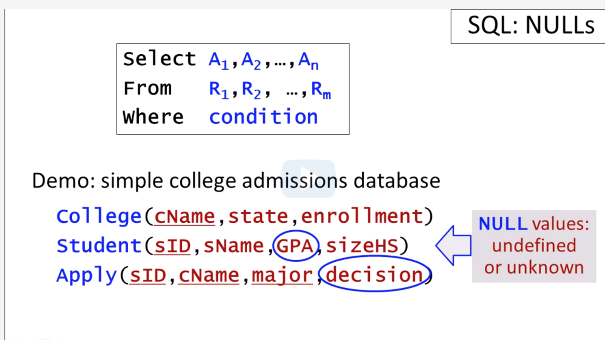

[Back to course index](./index.md)

## Null Values

Unless specified otherwise, in databases any value in an attribute can take on the special value **NULL** as well.

For example - we could have a student whose GPA is unknown and we'll represent that with a **NULL** or we could have a not yet made decision for an application in the Apply relation which we'll also represent with a **NULL**.



### Examples

**Example 1**

Let's imagine we insert some tuples in the Student relation with no GPA.

```SQL
INSERT INTO Student values (432, 'Kevin', null, 1500);
INSERT INTO Student values (321, 'Lori', null, 2500);
```

Any selector with the GPA won't return this tuples

```SQL
SELECT *
FROM Student
WHERE GPA < 3.5 or GPA >= 3.5
```

Even though the WHERE clause is a tautology - a logical expression that is always true, SQL can't determine it for these Students because the GPA is unknown.

If we wanted to select them by GPA, we'd have to use

```SQL
SELECT *
FROM Student
WHERE GPA is null
```

**Example 2**

```SQL
SELECT sID, sName, GPA, sizeHS
from Student
where GPA > 3.5 or sizeHS < 1600
```

This one will give us Kevin as well even though his GPA is null because the other attribute (sizeHS) satisfies the WHERE clause.

**Example 3**

```SQL
SELECT count(*)
FROM Student
WHERE GPA is not null;
```
