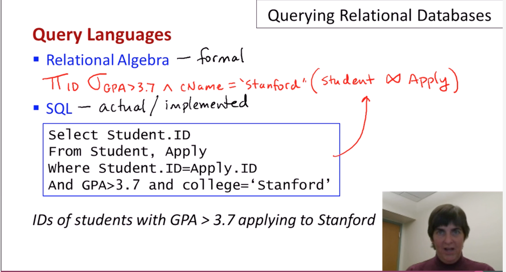

[Back to course index](./index.md)

## The Relational model

An efficient model that's used by all major commercial database systems. Can be queried with high-level languages.

## Querying Relational Databases

Once the Schema is created and the DB defined by the DDL, we are ready to bulk load the initial data and query the database.

Ad-hoc queries are done in high-level languages

Examples:

- All students with GPA > 3.7 applying to Stanford and MIT only.
- All engineering departments in CA with <500 applicants.
- College with highest average accept rate over the last 5 years.

**Composition**

Queries are **compositional** - a query can be run over the result of a previous query. This is also known as **closed** queries.

**Query Languages**

- Relational Algebra - formal
- SQL - actual / implemented

