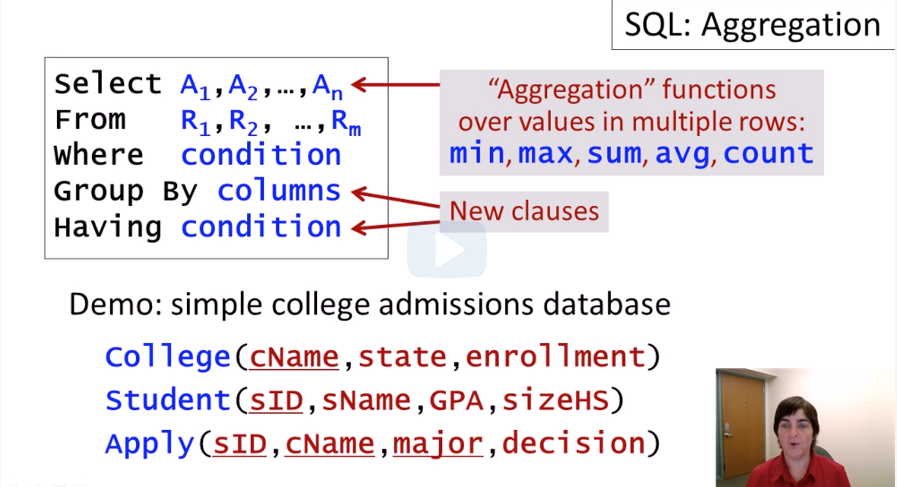

[Back to course index](./index.md)

## Aggregation

**_Aggregation_** functions appear in the SELECT statement initially and they perform computations over sets of values in multiple rows in the relation.

The basic **Aggregation** functions supported by every SQL system are:

- min
- max
- sum
- avg
- count

Once aggregation functions are added, there are additional clauses we can include in our SQL statement.

- Group by - partitions our relations into groups.
- Having - test filters over the result of aggregate values.



### Demos

1. Avg GPA

```SQL
select avg(GPA)
from Student;
```

2. Min GPA in Students who applied to major in CS

```SQL
SELECT MIN(GPA)
FROM Student
INNER JOIN Apply USING(sID)
WHERE Apply.major = 'CS';
```

The problem with this one is students with multiple applications will be counted multiple times in the average. To get what we meant to we should use

```SQL
select avg(GPA)
from Student
WHERE sID in (select distinct sID from Apply where major = 'cs');
```

```SQL
SELECT MIN(GPA)
FROM Student
INNER JOIN (
    SELECT DISTINCT sID
    FROM Apply
    WHERE major = 'CS'
) AS DistinctApply
ON Student.sID = DistinctApply.sID;
```

3. The count of colleges with enrollment over 5000.

```SQL
SELECT count(*)
FROM Colleges
WHERE enrollment >= 5000
```

4. The number of Students applying to 'Cornell'

```SQL
SELECT count (*)
FROM Apply
WHERE cName = 'Cornell';
```

Except this one will count the number of applications, not the unique students.

We should use the following instead:

```SQL
SELECT count(*)
FROM Apply
WHERE sID in (select distinct sID from Apply) and cName = 'Cornell';
```

The previous one is the correct query but SQL provides a shorthand for that.

```SQL
SELECT count(distinct sID)
FROM Apply
WHERE cName = 'Cornell';
```

5. Students such that the number of students with the same GPA is the equal to the the number of students with same sizeHS.

```SQL
SELECT *
FROM Student S1
WHERE (SELECT count(*) from Student S2
where S1.sID <> S2.sID and S1.GPA = S2.GPA)
=
(SELECT count(*) from Student S2
where S1.sID <> S2.sID and S2.sizeHS = S1.sizeHS);
```

6. The difference between avgGPA for CS and non-cs applications

```SQL
SELECT CS.avgGPA - nonCS.avgGPA
from (select avg(GPA) as avgGPA from Student
where sID in (select distinct sID from Apply where major = 'CS')) as CS,
(select avg(GPA) as avgGPA from Student where sID in (select distinct sID from Apply where major <> 'CS')) as nonCS;
```

### GROUP BY

Remember - Group by can only be used together with aggregations.

Its usage is to partition our relations into groups.

Demos:

1. Count of applications for each college (group by cName)

```SQL
SELECT cName, count(*)
FROM Apply
GROUP BY cName
```

2. Total sum of enrollment for each state in our database

```SQL
SELECT state, sum(enrollment)
FROM College
GROUP BY state
```

3. Min and MAX GPA for each pair of college name and Major

```SQL
SELECT cName, major, min(GPA), max(GPA)
FROM Student INNER JOIN Apply using(sID)
GROUP BY cName, major;
```

4. If we wanted to get the spread between min and max GPA for the groups, we can reuse the same query.

```SQL
SELECT M.cName, M.major, mx-mn
from (SELECT cName, major, min(GPA) as mn, max(GPA) as mx
FROM Student INNER JOIN Apply using(sID)
GROUP BY cName, major) M;
```

5. The number of colleges that have been applied to by each student.

```SQL
SELECT Student.sID, Student.sName, count(distinct cName)
from Student INNER JOIN APPLY using (sID)
group by Student.sID
```

6. The number of colleges thave been applied to by each student, incl. those who haven't applied to any college.

```SQL
SELECT Student.sID, Student.sName, count(distinct cName)
from Student INNER JOIN APPLY using (sID)
group by Student.sID
union
SELECT Student.sID, 0
FROM Student
WHERE sID not in (select sID from Apply);
```

### HAVING

The **HAVING** is only used in conjuncture with aggregations. The clause allows us to apply conditions to the result of the aggregate function.

So, the **HAVING** clause is applied after the **GROUP BY** clause and allows us to check conditions that concern the entire group.

In contrast, WHERE applies to only 1 tuple at a time.

Demos:

1. Colleges with fewer than 5 applications.

```SQL
SELECT cName
FROM Apply
GROUP BY cName
HAVING count(*) < 5
```

This statement can be rewritten without the HAVING and GROUP BY clauses.

```SQL
SELECT distinct cName
FROM Apply A1
WHERE 5 > (select (count *) from Apply A2
WHERE A2.cName = A1.cName);
```

2. Colleges with fewer than 5 applicants (one applicant could have applied multiple times)

```SQL
SELECT cName
FROM Apply
GROUP BY cName
HAVING count(distinct sID) < 5
```

3. Find all majors that have a MAX GPA Applicant less than the AVG.

```SQL
SELECT major
FROM Student INNER JOIN Apply using (sID)
GROUP BY major
having MAX(GPA) < (select AVG(GPA) from Student)
```
