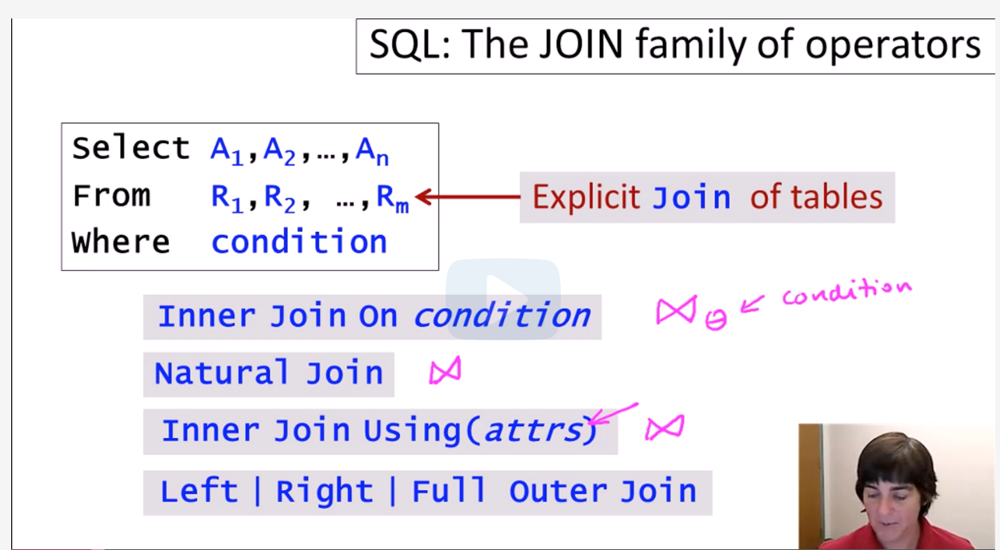
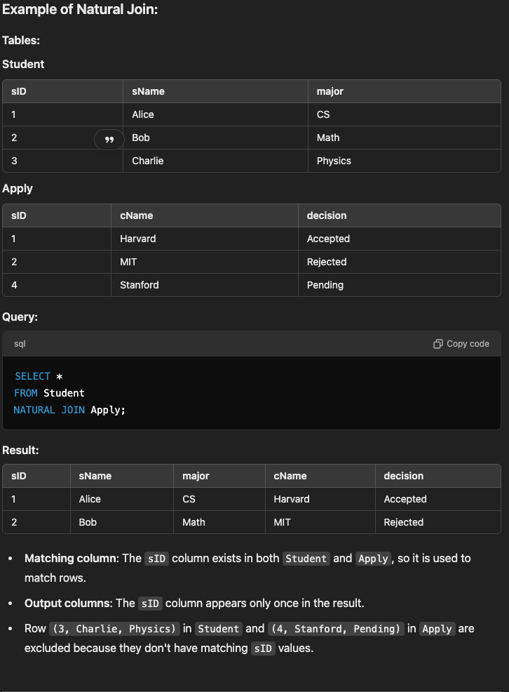

[Back to course index](../index.md)

## SQL: The JOIN Family of Operators



When we're listing the R1, R2... Rn in the FROM clause, SQL does a Cross-product or Cartesian product by default. This means that every tuple in every relation is matched with all other tuples in other relations.

### Natural Join

```SQL
select distinct sName, major
from Student NATURAL JOIN Apply;
```

This will return a join of all tuples that have a matching value in the attribute (sID) that is the same in both relations.

**How a Natural Join works**

1. Match columns with the same name: A Natural Join looks for columns with identical names in both relations.
2. Compare values: It combines rows where the values in these matching columns are the same.
3. Eliminate duplicates: The resulting relation includes each matching column only once in the output (it doesn't duplicate the column values).



**Natural join** is problematic with its syntax because we might end up in a situation where a new attribute is added to a relation that matches another one in the other relation and this will mess with the results we expect.

```SQL
select sName, GPA
from Student NATURAL JOIN Apply
where sizeHS > 1000 and major = 'CS' and cName = 'Stanford'
```

A better way to do it is to write it in the following way:

```SQL
select sName, GPA
from Student join Apply using(sID)
where sizeHS > 1000 and major = 'CS' and cName = 'Stanford'
```

**Example 2**

```SQL
SELECT S1.sID, S1.sName, S1.GPA, S2.sID, S2.sName, S2.GPA
FROM Student S1, Student S2
WHERE S1.GPA = S2.GPA and S1.sID < S2.sID;
```

Could be rewritten using JOIN to become more efficient because a full Cartesian Product of the tables will not be generated. The first query starts off with a Full Cartesian product and the following query will only do a JOIN on the rows where the GPA value is equal.

```SQL
SELECT S1.sID, S1.sName, S1.GPA, S2.sID, S2.sName, S2.GPA
FROM Student S1 join Student S2 using(GPA)
WHERE S1.sID < S2.sID
```

### Inner Join

**INNER JOIN** joins the tables **on a condition**. It is effectively the Cross (Cartesian) product of the 2 tables BUT when it does the join, it makes sure all tuples satisfy the **ON** condition.

**Example 1**

If we wanted to match the names of students to the majors they've applied to, we'll use the following query.

```SQL
SELECT DISTINCT sName, major
FROM Student, Apply
WHERE Student.sID = Apply.sID
```

In this query the FROM clause causes a JOIN (Carterisna product).

Let's rewrite it using the INNER JOIN.

```SQL
SELECT DISTINCT sName, major
FROM Student INNER JOIN Apply
ON Student.sID = Apply.sID
```

**INNER JOIN** is the default JOIN in SQL so we could remove the "INNER" and it will work the same way.

**Example 2**

We have a query that finds all students from a large highschool that applied to CS in Stanford

```SQL
SELECT sName, GPA
FROM Student, Apply
WHERE Student.sID = Apply.sID
    and sizeHS >= 1000 and major = 'CS' and cName = 'Stanford'
```

Let's rewrite that using the JOIN operator.

```SQL
select sName, GPA
from Student JOIN Apply
on Student.sID = Apply.sID
where sizeHS >= 1000 and major = 'CS' and cName = 'Stanford'
```

**Example 3**

A query that pulls a bunch of information about students, their applications and the college they applied to.

```SQL
SELECT Apply.sID, sName, GPA, Apply.cName, enrollment
from Apply, Student, College
where Apply.sID = Student.sID and Apply.cName = College.cName
```

Now let's rewrite it with JOIN.

```SQL
SELECT Apply.sID, sName, GPA, Apply.cName, enrollment
from (Apply join Student on Apply.sID = Student.sID) join College
on Apply.cName = College.cName
```

### Outer Join

Not all students have applied to a college. Using the query below will give us a dataset of tuples where each Student has an application.

```SQL
select sName, sID, cName, major
from Student inner join Apply using(sID);
```

If we wanted to see all students (incl. those who haven't applied to any college), we can use a **left outer** join.

```SQL
select sName, sID, cName, major
from Student left outer join Apply using(sID);
```

;

The blank values in cName, major attributes are the student records that have no application whatsover.

**How left outer join works**
**Left outer** join takes any tuples on the left side of the join and if they don't have a matching tuple (this occurrence is called a **_dangling tuple_** - tuple that has no match) it is still added to the result and padded with null values.

**Natural outer join**
This thing exists - it's also not recommended from a Software Engineering perspective because of the same problems described with Natural join but it's still worth noting its existance.

```SQL
select sName, sID, cName, major
from Student natural left (outer) join Apply;
```

**_Outer_** is optional. The shorthand expression works the same. What this will do is a Natural Left Outer Join which means it will try to find the same attribute (sID) in both relations and do the **Left Outer Join** afterwards.

**Regural SQL without JOINs**
All of the demos we've seen in the lessons so far could be rewritten with regular SELECT FROM WHERE SQL statements without JOINS.

Inner join is an obvious one but Outer join is less obvious that it can be rewritten.

```SQL
SELECT sName, sID, cName, major
from Student, Apply
where Student.sID = Apply.sID
union
select sName, sID, NULL, NULL
from Student
where sID not in (select sID from Apply);
```

**Right outer JOIN**
It's the absolute same as LEFT Outer JOIN but on the opposite side. It adds to the dataset all dangling tuples from the right side that have no matching tuple in the left.

**Full Outer Join**
Both Left and Right Outer Join. Adds all dangling tuples from both left and right side.

It can be of course written in SQL without JOINS.

Full Outer Join as a union:

```SQL
select sName, sID, cName, major
from Student left outer join Apply using(sID);
union
select sName, sID, cName, major
from Student right outer join Apply using (sID);
```

Full Outer Join without JOINs:

```SQL
select sName, Student.sID, cName, major
from Student, Apply
where Student.sID = Apply.sID
union
select sName, sID, NULL, NULL
from Student
where sID not in (select sID from Apply)
union select NULL, sID, cName, major
from Apply
where sID not in (select sID from Student);
```

**Outer JOINs are not Associative**. The order in which we execute the JOINs matters and will produce different results.

The **Full Outer Join** is commutative but not Associative. Left & Right Outer JOINs are not Commutative nor Associative.

This means that when we're doing Outer Joins we should think about the order in which we want to do them. Not because of performance reasons but because the resulting dataset will most likely be different if we change the order.
