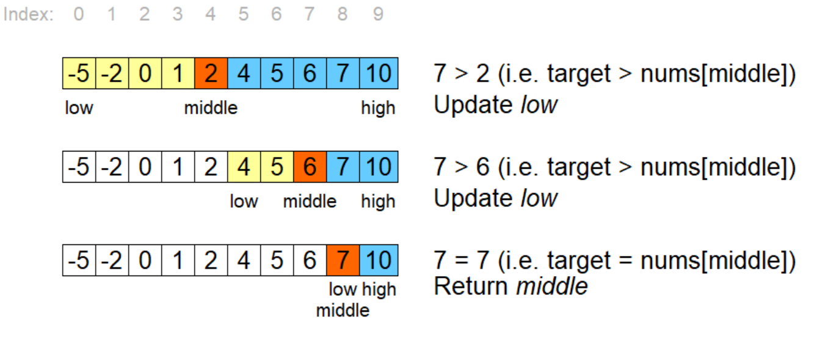

[Back to Common Algorithms](03-common-algorithms.md)
## Searching algorithms

*Searching algorithms* are essential tools in computer science used to locate specific items within a collection of data.
### Binary search

Binary search is a search algorithm that finds the position of a target value within a sorted array. 

Binary search compares the target value to the middle element of the array. 
If they are not equal, the half in which the target cannot lie is eliminated and the search continues on the remaining half, again taking the middle element to compare to the target value, and repeating this until the target value is found. If the search ends with the remaining half being empty, the target is not in the array.

**Available Resources:**

- [Binary Search - Khan Academy](https://www.khanacademy.org/computing/computer-science/algorithms/binary-search/a/binary-search)
- [Binary Search](https://www.topcoder.com/thrive/articles/Binary%20Search)
- [Binary Search in 4 Minutes](https://www.youtube.com/watch?v=fDKIpRe8GW4&feature=youtu.be)
- [Binary Search - CS50](https://www.youtube.com/watch?v=D5SrAga1pno)

### Linear search

Linear search is a very simple algorithm that is used to search for a value in an array. It sequentially checks each element of the array until a match is found or until all the elements have been searched.

