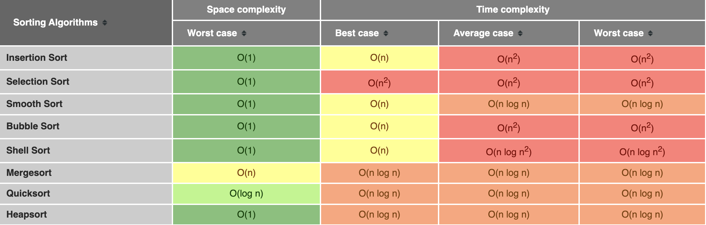

[Back to Common Algorithms](03-common-algorithms.md)
## Sorting Algorithms

A Sorting Algorithm is an algorithm that puts elements of a list into an order. The most frequently used orders are numerical order and lexicographical order, and either ascending or descending. 

Efficient sorting is important for optimising the efficiency of other algorithms (such as search and merge algorithms) that require input data to be in sorted lists. 

### Bubble Sort

Bubble sort is a simple sorting algorithm that repeatedly steps through the list, compares adjacent elements and swaps them if they are in the wrong order. The pass through the list is repeated until the list is sorted.

**Time complexity**: `O(n^2)`

	

### Selection Sort

Selection sort is a sorting algorithm that selects the smallest unsorted item in the list and swaps it with index 0, then finds the next smallest and places it into index 1 and so on.

**Time complexity**: `O(n^2)`

	

### Insertion Sort

Insertion sort is a simple sorting algorithm that builds the final sorted array one item at a time by comparisons. 

It is much less efficient on large lists than more advanced algorithms such as quicksort, heapsort, or merge sort.

**Time complexity:** `O(n^2)`

	

### Heap Sort

Heap Sort is an efficient, comparison-based sorting algorithm that reorganizes an input array into a heap (a data structure where each node is greater than its children) and then repeatedly removes the largest node from that heap, placing it at the end of the array.

**Time complexity:** `O(n logn)`

	

А run of heapsort sorting an array of randomly permuted values. In the first stage of the algorithm the array elements are reordered to satisfy the heap property. Before the actual sorting takes place, the heap tree structure is shown briefly for illustration.

### Quick Sort

Quicksort is an efficient, general-purpose sorting algorithm. Overall, it is slightly faster than merge sort and heapsort for randomized data, particularly on larger distributions.[3]

Quicksort is a divide-and-conquer algorithm. It works by selecting a 'pivot' element from the array and partitioning the other elements into two sub-arrays, according to whether they are less than or greater than the pivot. For this reason, it is sometimes called partition-exchange sort. The sub-arrays are then sorted recursively. This can be done in-place, requiring small additional amounts of memory to perform the sorting.

**Time complexity:** `O(n logn)` (worst case is `O(n^2))

	

### Merge Sort

Merge Sort is an efficient, general-purpose, and comparison-based sorting algorithm. Most implementations produce a stable sort, which means that the relative order of equal elements is the same in the input and output. 

Merge sort is a divide-and-conquer algorithm that was invented by John von Neumann in 1945.

**Time complexity:** `O(n logn)`

	

### Sorting Algorithms Big O Notation

	

