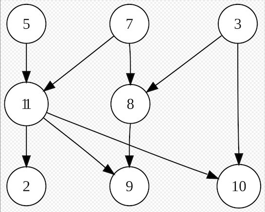
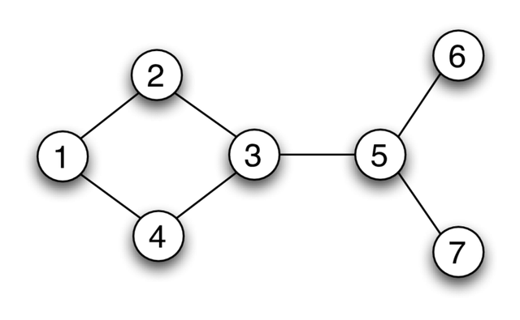
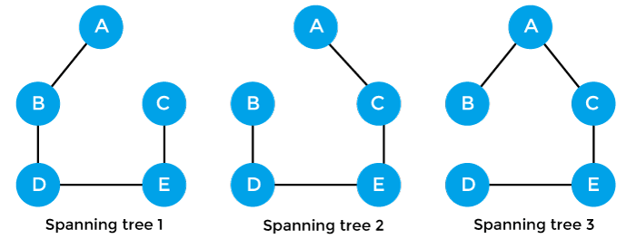

[Back to Data Structures](01-data-structures.md)
## Graphs

Graphs are non-linear data structures made up of a finite number of nodes or vertices and the edges that connect them. 

Graphs are used to address real-world problems in which it represents the problem area as a network like telephone networks, circuit networks, and social networks.

	

### Directed Graph

A directed graph is graph, i.e., a set of objects (called vertices or nodes) that are connected together, where all the edges are directed from one vertex to another. A directed graph is sometimes called a digraph or a directed network. 

	

### Undirected Graph

An undirected graph is graph, i.e., a set of objects (called vertices or nodes) that are connected together, where all the edges are bidirectional. An undirected graph is sometimes called an undirected network

	

### Spanning Tree

A spanning tree is a subset of Graph G, which has all the vertices covered with minimum possible number of edges. Hence, a spanning tree does not have cycles and it cannot be disconnected.

	

### Available Resources

- [Graph Data Structure](https://www.simplilearn.com/tutorials/data-structure-tutorial/graphs-in-data-structure)
- [Graph Data Structure | Illustrated Data Structures](https://www.youtube.com/watch?v=0sQE8zKhad0)
- [CSE373 2020 - Lecture 10 - Graph Data Structures](https://www.youtube.com/watch?v=Sjk0xqWWPCc&list=PLOtl7M3yp-DX6ic0HGT0PUX_wiNmkWkXx&index=10)
- [CSE373 2020 - Lecture 11 - Graph Traversal](https://www.youtube.com/watch?v=ZTwjXj81NVY&list=PLOtl7M3yp-DX6ic0HGT0PUX_wiNmkWkXx&index=11)
- [CSE373 2020 - Lecture 12 - Depth First Search](https://www.youtube.com/watch?v=KyordYB3BOs&list=PLOtl7M3yp-DX6ic0HGT0PUX_wiNmkWkXx&index=12)