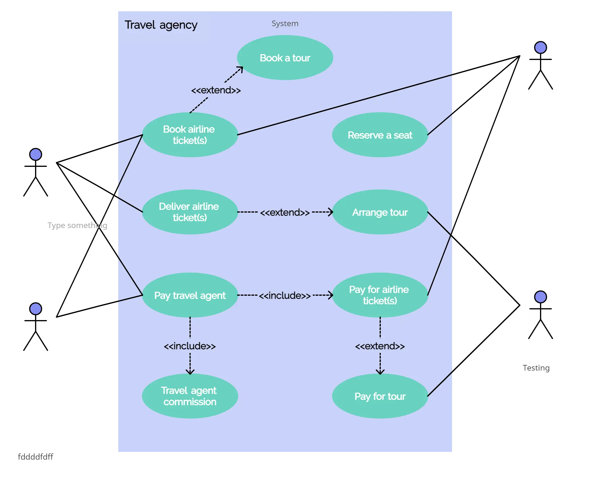

[Back to Computer Science frontpage](computer-science.md)

# Common UML Diagrams

UML(Unified-Model-Language) is a standard way of visualizing a software system. It is a general-purpose, developmental, modeling language in the field of software engineering that is intended to provide a standard way to visualize the design of a system.

## Class Diagrams

Class Diagrams are used to model the static structure of a system. They are used to show the classes, their attributes, operations (or methods), and the relationships between objects.

[UML Class Diagrams](https://www.visual-paradigm.com/guide/uml-unified-modeling-language/uml-class-diagram-tutorial/)

	

## Use case Diagrams

Use case diagrams are a type of diagram that are used to model the interactions between the **actors** and the **use cases** of the system.

An actor is a person or a system that interacts with the system. Actors are represented by a rectangle with the name of the actor written inside it.

A use case is a task that the system performs. Use cases are represented by an ellipse with the name of the use case written inside it.

A use case diagram is a diagram that shows the actors and the use cases of the system. The diagram is represented by a rectangle that contains the name of the system inside it. The actors are represented by rectangles and the use cases are represented by ellipses.

[What is Use case Diagram](https://www.visual-paradigm.com/guide/uml-unified-modeling-language/what-is-use-case-diagram/)

	

## Activity Diagrams

Activity diagrams are used to model the flow of control in a system. They are used in conjunction with Use case diagrams to model the behavior of the system for each use case. 

They are also used to model the behavior of a single class.

[What is Activity Diagram?](https://www.visual-paradigm.com/guide/uml-unified-modeling-language/what-is-activity-diagram/)

	

## State Machine Diagrams

State machine diagrams are used to show the different states an object can be in at a given time. The object can be in one and only one state at a given time. 

State machine diagrams are similar to activity diagrams, but they are more focused on the flow of an object's state rather than the flow of the object itself.

[What is State Machine Diagram?](https://www.visual-paradigm.com/guide/uml-unified-modeling-language/what-is-state-machine-diagram/)

## Sequence Diagrams

Sequence diagrams are a way to show how objects or systems interact with each other over time.

[What is a Sequence UML Diagram?](https://www.visual-paradigm.com/guide/uml-unified-modeling-language/what-is-sequence-diagram/)

## Available Resources

- [Bit Manipulation](https://www.youtube.com/watch?v=7jkIUgLC29I)
- [Binary: Plusses & Minuses (Why We Use Twos Complement) - Computerphile](https://www.youtube.com/watch?v=lKTsv6iVxV4)
- [Algorithms: Bit Manipulation](https://www.youtube.com/watch?v=NLKQEOgBAnw)

