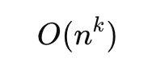

[Back to Computer Science frontpage](computer-science.md)

# Complexity Classes

In computer science, there exist some problems whose solutions are not yet found, the problems are divided into classes known as Complexity Classes. 

In complexity theory, a Complexity Class is a set of problems with related complexity. These classes help scientists to groups problems based on how much time and space they require to solve problems and verify the solutions. It is the branch of the theory of computation that deals with the resources required to solve a problem.

## Deterministic vs Non-deterministic

- **Deterministic**
	At each step, there’s **only one choice** of what to do next. It’s like following a **recipe**: do this, then that, then that. No surprises. This is how your real-world computer works.

- **Non-deterministic**
	At some steps, the machine can choose from **multiple options**. It’s like reaching a **fork in the road**, and somehow magically trying **all paths at once**. 
	
	Or more precisely - it magically picks the **right path** — the one that leads to a “yes” answer — if such a path exists.

## P 

The P in the *P* class stands for Polynomial Time. It is the collection of decision problems(problems with a “yes” or “no” answer) that can be solved by a deterministic machine in polynomial time.

An algorithm runs in **polynomial time** if its time complexity can be expressed as:

	

Where:
- *n* is the **size of the input**
- *k* is some **constant** (e.g., 1, 2, 3, …, n, ...)

## NP

The NP in NP class stands for Non-deterministic Polynomial Time. It is the collection of decision problems that can be solved by a non-deterministic machine in polynomial time.

Technically it covers problems that can be easily verified in polynomial time but finding the solution for them might take a lot longer.

**Example**

Given a Sudoku puzzle, is there a valid solution?

- If someone gives you a completed grid, you can check it **quickly**. 
- But finding that solution? Might take a long time.

## P = NP ?

The P = NP problem is one of the most famous problems in computer science. It asks whether a problem that can be solved in polynomial time on a non-deterministic machine (i.e., the problem is in NP) can also be solved in polynomial time on a deterministic machine (i.e., the problem is in P).

What the P = NP problem covers in theory is whether a problem we can quickly verify the solution for(NP) can also be solved quickly (P).

If it was proven that P=NP, it would revolutionize computing as we know it because cryptography and hashing would be easily crackable.

So far, we don't know whether P = NP or P ≠ NP. Matter of fact - whoever solves it is promised a $1MM prize by the Clay Mathematics Institute.

## Co-NP

Co-NP stands for the complement of NP Class. It means if the answer to a problem in Co-NP is No, then there is proof that can be checked in polynomial time.

NP is about problems where we can verify a "Yes" answer quickly, Co-NP is the opposite - we can verify a "No" answer quickly (in polynomial time).

## NP-hard

An NP-hard problem is at least as hard as the hardest problem in NP and it is the class of the problems such that every problem in NP reduces to NP-hard.

Might not be verifiable in polynomial time like NP problems. Possibly harder than them too.

## NP-complete

**NP-complete** is a **subset of NP** that consists of the **hardest problems** in NP.
    
A problem is **NP-complete** if:
    
- It is in **NP** (you can verify a solution in polynomial time).
- It is NP-hard (meaning, if you could solve this problem in polynomial time, you could solve all NP problems in polynomial time).

So, **NP-complete** problems are **the hardest problems** in NP. They represent the **boundary** between problems that are solvable in polynomial time (if P = NP) and those that might not be.

## Available Resources

- [Trying to understand P vs NP vs NP Complete vs NP Hard](https://softwareengineering.stackexchange.com/questions/308178/trying-to-understand-p-vs-np-vs-np-complete-vs-np-hard)
- [Complexity: P, NP, NP-completeness, Reductions](https://www.youtube.com/watch?v=eHZifpgyH_4&list=PLUl4u3cNGP6317WaSNfmCvGym2ucw3oGp&index=22)
- [Complexity: Approximation Algorithms](https://www.youtube.com/watch?v=MEz1J9wY2iM&list=PLUl4u3cNGP6317WaSNfmCvGym2ucw3oGp&index=24)
- [Complexity: Fixed-Parameter Algorithms](https://www.youtube.com/watch?v=4q-jmGrmxKs&index=25&list=PLUl4u3cNGP6317WaSNfmCvGym2ucw3oGp)
- [Lecture 23: Computational Complexity](https://www.youtube.com/watch?v=moPtwq_cVH8&list=PLUl4u3cNGP61Oq3tWYp6V_F-5jb5L2iHb&index=24)
- [Greedy Algs. II & Intro to NP Completeness](https://youtu.be/qcGnJ47Smlo?list=PLFDnELG9dpVxQCxuD-9BSy2E7BWY3t5Sm&t=2939)
- [NP Completeness II & Reductions](https://www.youtube.com/watch?v=e0tGC6ZQdQE&index=16&list=PLFDnELG9dpVxQCxuD-9BSy2E7BWY3t5Sm)
- [NP Completeness III](https://www.youtube.com/watch?v=fCX1BGT3wjE&index=17&list=PLFDnELG9dpVxQCxuD-9BSy2E7BWY3t5Sm)
- [NP Completeness IV](https://www.youtube.com/watch?v=NKLDp3Rch3M&list=PLFDnELG9dpVxQCxuD-9BSy2E7BWY3t5Sm&index=18)