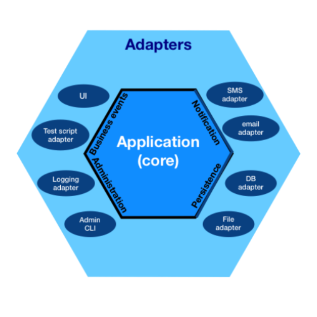

[Back to Architectural Styles](07-architectural-styles.md)
## Hexagonal Architecture
The **hexagonal architecture**, or **ports and adapters architecture**, is an architectural pattern used in Software Design. It aims at creating loosely coupled application components that can be easily connected to their software environment by means of ports and adapters. This makes components exchangeable at any level and facilitates test automation.

### Available Resources
- [Hexagonal Architecture - Wikipedia](https://en.wikipedia.org/wiki/Hexagonal_architecture_(software))